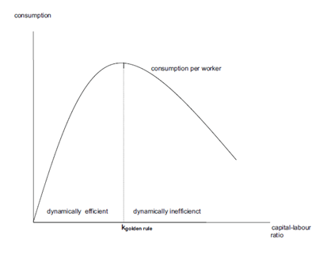

% Assignment 2
% Sjoerd Hooijmaaijers
% Tilburg University

Introduction
================

Introduction
----------

For this assignment, I have chosen to pick previous assignments from the course Generational Economics.
Fearing that only one may have been too short, I will include the first and the second (out of a total of 6) assignment of this course.
Both have mathematical derivations, but perhaps lack a few words.

Question 1
--------

Assume that production is described by $Y=AK^a L^b$, A, a and b are positive constants
\subsection{Question 1}
\subsubsection*{ i. Is this production function neoclassical? Which of the neoclassical conditions does it satisfy and which ones not?}
There are three conditions for a neoclassical function.\
Condition 1: Constant returns to scale \
$$ \lambda Y = F(\lambda K,\lambda L)$$ \
$$ \lambda Y = A*\lambda K^a*\lambda L^b$$ \
$$ \lambda Y = A*\lambda ^{a+b}* K^a* L^b$$ \
$$ \lambda Y = \lambda ^{a+b}F(\lambda K,\lambda L)$$ \

Question 1
-----------

Thus, a+b=1 \
And similarly; b=1-a \ 
Condition 2: Positive but diminishing returns

$$ \frac{\delta F}{\delta K} = aAK^{a-1}L^{1-a} > 0 $$ \
$$ \frac{\delta ^2 F}{\delta K^2} = (a-1)aAK^{a-2}L^{1-a} < 0		$$ \

Question 1
---------
$$ \frac{\delta F}{\delta L} = aAK^{a}L^{-a} > 0 $$ \
$$ \frac{\delta ^2 F}{\delta L^2} = -a(1-a)AK^{a}L^{-a-1} < 0		$$ \

Question 1
---------

Condition 3. Inada conditions \
The marginal product of capital is \
$$ MPK = aAK^{a-1}L^{1-a} $$ \
$$ = aA\frac{K}{L}^{a-1} $$ \

Question 1
---------

and thus
$$ \lim_{k\to\infty} aA \frac{K}{L}^{a-1} =0 $$ \
$$ \lim_{k\to 0} aA \frac{K}{L}^{a-1} = \infty $$ \
\

Question 1
---------

The marginal product of labour is \
$$ MPL = (1-a)AK^{a}L^{-a} $$ \
$$ = (1-a)A\frac{K}{L}^{a} $$ \
and thus
$$ \lim_{k\to\infty} (1-a)A \frac{K}{L}^{a} =0 $$ \
$$ \lim_{k\to 0} (1-a)A \frac{K}{L}^{a} = \infty $$ \

In conclusion, all three requirements are fulfilled

Question 2
---------

Write output per labour efficiency unit (y) as a function of capital per labour
efficiency unit (k). What is the marginal product of k?

Remember we can write the production function as \
$$ Y=AK^a L^{a-1} $$ \

Question 2
---------

Then, taking per labour efficiency units \
$$ \frac{Y}{L}= A \frac{K}{L}^{a} \frac{L}{L}^{a-1} $$ \
Or in other terms \
$$ y=Ak^a $$ \

Then the marginal product of k is: \
$$ f(k)=Ak^a $$ \
$$ f'(k)=aAk^{a-1} $$ \

Question 3
--------

 Assume that an economy is in a dynamically inefficient steady state when the rate of population growth n rises to a permanently higher level. Assume that investment per labour efficiency unit i does not change and that the capital-labour ratio converges to a new steady-state level. Will utility in the long run increase or decrease? Explain your answer!

Question 3
--------

Taking that the economy starts off in a dynamically inefficient steady-state, it is located somewhere in the right hand side of the above graph. \ If the rate of population growth increases, and holding investment per labor efficiency unit constant, we can state, from the equation in $$i=(\delta+g)k$$, that capital-labor ratio will decrease (intuitively, it makes sense considering that population now grows quicker – and so will labor – while, for capital, we see no difference)

Question 3
--------

Graphically, this means that the steady-state will now be represented further to the left. \Given this, in the long-run, utility will increase as consumption increases, as the economy approaches its optimal capital-labor ratio. \
However, it is important to denote that if the decrease in k is large enough, it could also lead to the Golden Rule capital-labor ratio being surpassed, which would lead to a less-than-optimal utility. \

Question 3
-------

